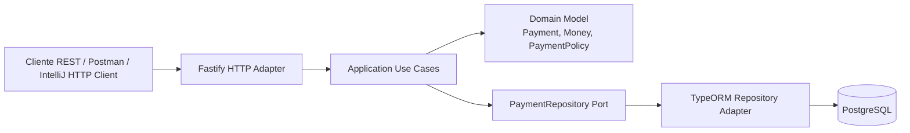

# Payment Processing Microservice PoC - Node.js 24 + Fastify + DDD Hexagonal

## 1. Descripción

Esta PoC implementa un microservicio REST de procesamiento de pagos usando Node.js 24, TypeScript, Fastify, TypeORM y PostgreSQL. El caso de uso simula autorización, captura, consulta y devolución de pagos. El diseño sigue DDD y arquitectura hexagonal para separar dominio, aplicación e infraestructura.

## 2. Funcionalidad principal

- Crear un pago con `idempotency-key`.
- Autorizar automáticamente pagos menores o iguales al umbral configurado.
- Rechazar pagos por encima del umbral de revisión.
- Consultar pagos por ID.
- Listar pagos.
- Capturar pagos autorizados.
- Reembolsar pagos capturados.
- Documentación OpenAPI en `/docs` y referencia Scalar en `/reference`.
- Health check en `/health`.

## 3. Stack técnico

- Runtime: Node.js 24.
- Lenguaje: TypeScript.
- Framework REST: Fastify 5.
- ORM: TypeORM.
- Base de datos: PostgreSQL 17.
- Validación/configuración: Zod + YAML.
- Documentación API: OpenAPI, Swagger UI y Scalar.
- Testing: Vitest.
- Infraestructura local: Docker Compose.

## 4. Arquitectura



## 5. Estructura del proyecto

```text
nodejs24-payment-microservice-poc/
├── src/
│   ├── domain/
│   │   ├── entities/
│   │   ├── value-objects/
│   │   ├── repositories/
│   │   ├── services/
│   │   └── events/
│   ├── application/
│   │   ├── commands/
│   │   ├── dtos/
│   │   └── use-cases/
│   ├── infrastructure/
│   │   ├── config/
│   │   ├── db/
│   │   └── http/
│   ├── shared/
│   ├── app.ts
│   └── main.ts
├── infrastructure/
│   ├── docker-compose.yml
│   ├── Dockerfile
│   ├── requests/
│   │   └── payments.http
│   └── datasets/
│       ├── README.md
│       └── sql/
│           └── 001_seed_payments.sql
├── test/
├── properties.yml
├── package.json
└── README.md
```

## 6. Código principal

### Dominio

- `Payment`: agregado principal. Controla estados `PENDING`, `AUTHORIZED`, `REJECTED`, `CAPTURED` y `REFUNDED`.
- `Money`: value object que valida monto y moneda ISO-4217.
- `PaymentPolicy`: regla de dominio para autorizar o rechazar pagos según monto máximo sin revisión.
- `PaymentRepository`: puerto de salida del dominio/aplicación.

### Aplicación

- `CreatePaymentUseCase`: crea pagos, aplica idempotencia y ejecuta política de autorización.
- `CapturePaymentUseCase`: captura pagos autorizados.
- `RefundPaymentUseCase`: reembolsa pagos capturados.
- `GetPaymentUseCase` y `ListPaymentsUseCase`: consultas.

### Infraestructura

- `Fastify`: expone endpoints REST.
- `TypeORM`: adapta el puerto `PaymentRepository` a PostgreSQL.
- `properties.yml`: configuración externa de servidor, base de datos y reglas de pago.

## 7. Endpoints REST

| Método | Endpoint | Descripción |
|---|---|---|
| GET | `/health` | Estado del servicio |
| POST | `/payments/v1/payments` | Crear y autorizar/rechazar pago |
| GET | `/payments/v1/payments` | Listar pagos |
| GET | `/payments/v1/payments/{paymentId}` | Consultar pago |
| POST | `/payments/v1/payments/{paymentId}/capture` | Capturar pago autorizado |
| POST | `/payments/v1/payments/{paymentId}/refund` | Reembolsar pago capturado |

## 8. Levantar infraestructura

Desde la raíz del proyecto:

```bash
docker compose -f infrastructure/docker-compose.yml up -d
```

Servicios:

- PostgreSQL: `localhost:5432`
- pgAdmin: `http://localhost:5050`
  - Usuario: `admin@local.dev`
  - Password: `admin`

Base de datos:

- DB: `payments_db`
- User: `payments_user`
- Password: `payments_pass`

## 9. Ejecutar el microservicio localmente

```bash
npm install
npm run dev
```

El servicio quedará disponible en:

```text
http://localhost:3000
```

Documentación:

```text
http://localhost:3000/docs
http://localhost:3000/reference
```

## 10. Ejecutar tests

```bash
npm test
```

## 11. Compilar y ejecutar en modo producción

```bash
npm run build
npm start
```

## 12. Ejecutar con Dockerfile

```bash
docker build -f infrastructure/Dockerfile -t payment-processing-nodejs24 .
docker run --rm -p 3000:3000 --network host payment-processing-nodejs24
```

En Linux, `--network host` permite que el contenedor use PostgreSQL en `localhost`. En Windows/Mac puede requerirse ajustar `properties.yml` para apuntar a `host.docker.internal` o crear una red compartida.

## 13. Probar requests

Usa el archivo:

```text
infrastructure/requests/payments.http
```

Puede ejecutarse desde IntelliJ IDEA Ultimate, WebStorm, VS Code REST Client o Postman.

## 14. Ejemplo request/response

### Crear pago autorizado

Request:

```http
POST /payments/v1/payments HTTP/1.1
Host: localhost:3000
Content-Type: application/json
idempotency-key: demo-payment-001

{
  "merchantId": "mrc_intercorp_001",
  "customerId": "cus_1001",
  "amount": 120.50,
  "currency": "USD"
}
```

Response:

```json
{
  "id": "uuid",
  "merchantId": "mrc_intercorp_001",
  "customerId": "cus_1001",
  "amount": 120.5,
  "currency": "USD",
  "status": "AUTHORIZED",
  "createdAt": "2026-06-14T00:00:00.000Z",
  "updatedAt": "2026-06-14T00:00:00.000Z",
  "idempotencyKey": "demo-payment-001"
}
```

### Crear pago rechazado por política

```json
{
  "merchantId": "mrc_intercorp_001",
  "customerId": "cus_1002",
  "amount": 6500,
  "currency": "USD"
}
```

Resultado esperado:

```json
{
  "status": "REJECTED"
}
```

## 15. Datasets

Los datos iniciales están en:

```text
infrastructure/datasets/sql/001_seed_payments.sql
```

Ver instrucciones completas en:

```text
infrastructure/datasets/README.md
```
